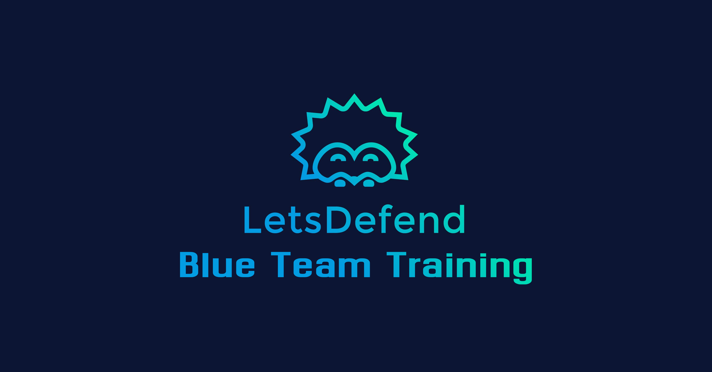

# LetsDefend Write-ups

This repository contains my LetsDefend write-ups.

Check out the LetsDefend website: <https://letsdefend.io>

Here's a link to my LetsDefend profile: <https://app.letsdefend.io/user/kaifmohamad923>

## LetsDefend Write-ups Table

| Alert Name | Description 
|:---:|:---:|
| [SOC165](SOC165/README.md) | Possible SQL Injection Payload Detected. |
| [SOC166](SOC166/README.md) | Javascript Code Detected in Requested URL. |
| [SOC167](SOC167/README.md) | LS Command Detected in Requested URL |
| [SOC169](SOC169/README.md) | Possible IDOR Attack Detected |