# SOC104 - Malware Detected | LetsDefend Writeup

## Room Information

- **Platform:** :contentReference[oaicite:0]{index=0}
- **Alert Name:** SOC104 - Malware Detected
- **Event ID:** 36
- **Category:** Malware Investigation
- **Difficulty:** Medium

---

## Scenario

A malware alert was triggered after a suspicious executable file was downloaded on an endpoint inside the environment. During the investigation, multiple indicators including malicious network communication, ransomware-related hashes, and suspicious outbound traffic were identified.

---

# Tools Used

- SIEM Dashboard
- VirusTotal
- Endpoint Security
- Proxy Logs
- Threat Intelligence Sources

---

# Initial Alert Investigation

The investigation started from the monitoring dashboard where a high severity malware alert was triggered on the host `AdamPRD`.

  

After opening the alert details, important artifacts such as hostname, source IP, file name, hash value, and device action were identified. The suspicious file was `Invoice.exe`.

  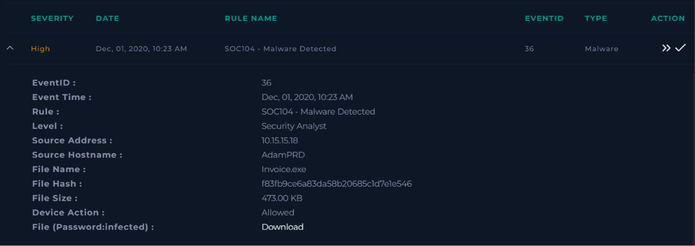

---

# Creating the Incident Case

A new incident case was created from the alert to begin the investigation and launch the malware response playbook.

  

The case information confirmed that the alert was categorized as a malware incident.

  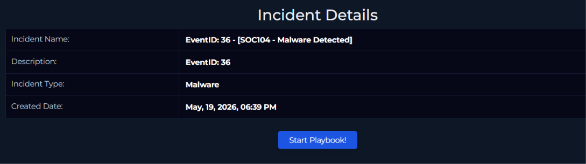

---

# Defining the Threat Indicator

During the playbook execution, the malware-related threat indicator was selected based on the suspicious executable behavior and network activity observed during the investigation.

  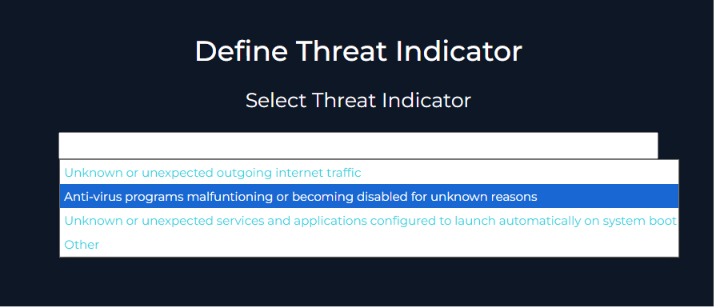

---

# Reviewing Network Activity

The next step involved reviewing proxy and network logs associated with the infected endpoint. Suspicious outbound traffic was identified from `10.15.15.18` communicating with the external IP `92.63.8.47` over port `443`.

  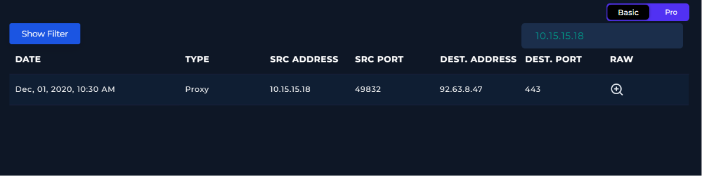

The raw event logs confirmed the exact malicious URL accessed by the endpoint.

  

---

# VirusTotal Analysis

The suspicious IP address was analyzed on VirusTotal. Multiple security vendors flagged the IP as malicious and associated it with malware infrastructure activity.

  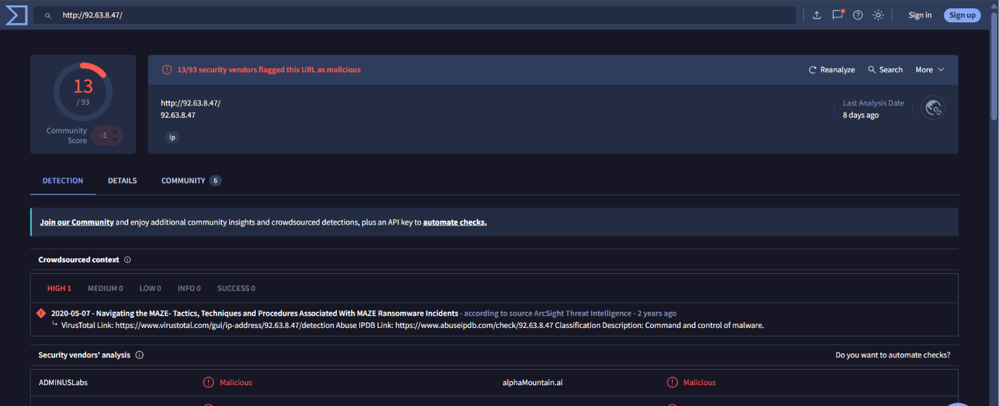

The downloaded executable hash was also checked on VirusTotal. The file was detected by many vendors and linked with ransomware behavior, specifically Maze ransomware indicators.

  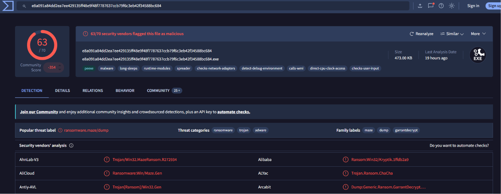

---

# Malware Validation

Additional malware analysis confirmed that the executable was malicious. Based on the indicators and VirusTotal detections, the malware classification was validated successfully.

  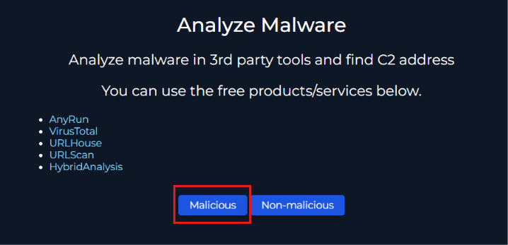

---

# Checking C2 Communication

The investigation then focused on identifying Command and Control (C2) communication attempts. Log analysis confirmed that the infected endpoint had accessed the malicious C2 infrastructure.

  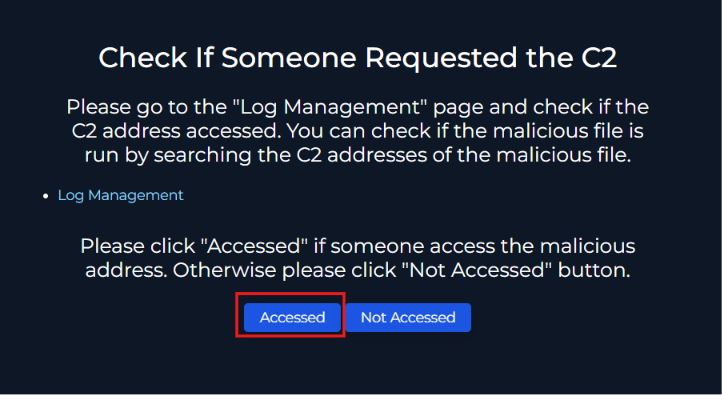

---

# Endpoint Containment

The infected machine was isolated through the EDR platform to prevent further communication with external malicious infrastructure.

  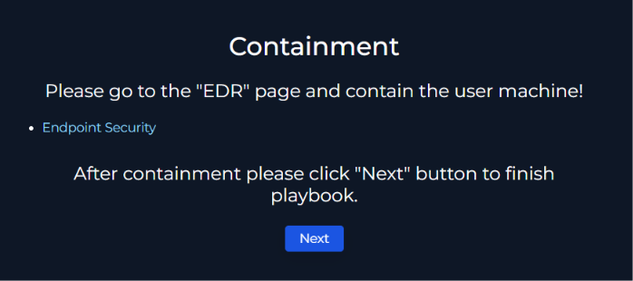

The endpoint containment status later confirmed that the host was successfully isolated.

  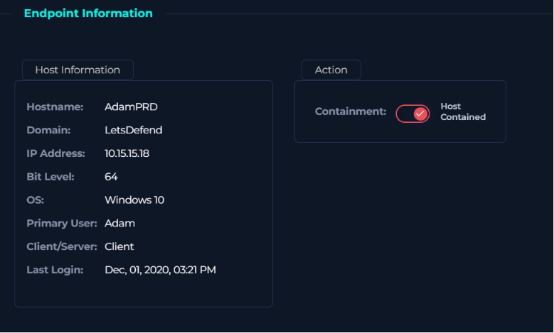

---

# Adding Investigation Artifacts

Important investigation artifacts including victim IP, C2 IP address, malicious URL, and malware hash were documented inside the incident case for future reference and tracking.

  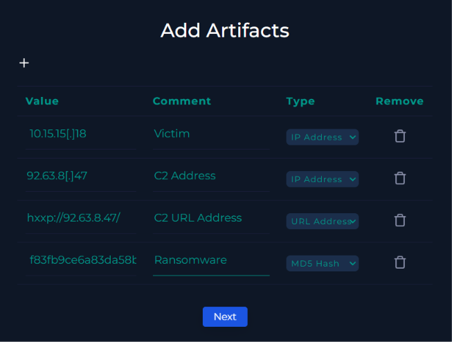

---

# Analyst Notes

An analyst note was added to summarize the malware detection findings, affected host information, and timeline of the incident.

  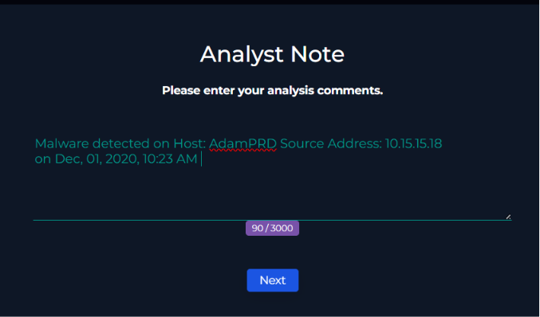

---

# Completing the Playbook

After validating all indicators and containment actions, the malware response playbook was completed successfully.

  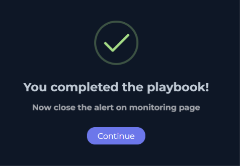

---

# Closing the Alert

The alert was marked as a True Positive because the investigation confirmed active malware behavior and malicious communication from the endpoint.

  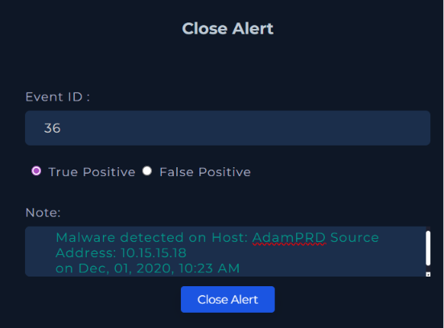

The final alert summary displayed all completed investigation actions and playbook responses.

  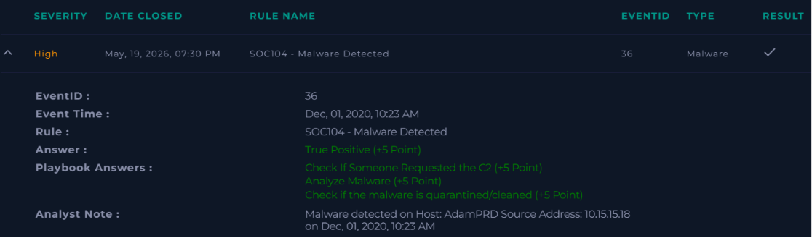

---

# Conclusion

This investigation confirmed the presence of a malicious executable on the endpoint `AdamPRD`. The malware established communication with a malicious external IP and showed ransomware-related indicators associated with Maze ransomware. After validating the threat through VirusTotal and log analysis, the infected host was successfully contained to prevent further compromise.

---

# Artifacts Identified

| Type | Value |
|------|------|
| Victim IP | `10.15.15.18` |
| Hostname | `AdamPRD` |
| Malicious IP | `92.63.8.47` |
| Malicious URL | `hxxp://92.63.8.47/` |
| File Name | `Invoice.exe` |
| File Hash | `f83fb9ce6a83da58b20685c1d7e1e546` |

---

# MITRE ATT&CK Mapping

| Technique | Description |
|------|------|
| T1105 | Ingress Tool Transfer |
| T1071 | Application Layer Protocol |
| T1041 | Exfiltration Over C2 Channel |
| T1486 | Data Encrypted for Impact |

---

# Disclaimer

This writeup was created for educational and defensive cybersecurity learning purposes only.