# SOC165 - Possible SQL Injection Payload Detected

## Description

This alert was triggered after detecting a possible SQL Injection payload targeting a web server.  
The investigation focused on analyzing the suspicious request, decoding the payload, checking the source IP reputation, reviewing firewall logs, and validating whether the activity was malicious or part of an authorized test.

---

# Tools Used

- LetsDefend SIEM
- VirusTotal
- URL Decoder

---

# Alert Overview

The investigation started with a high severity alert named:

`SOC165 - Possible SQL Injection Payload Detected`

After opening the alert, I reviewed the event details including the source IP, destination IP, request method, and requested URL.

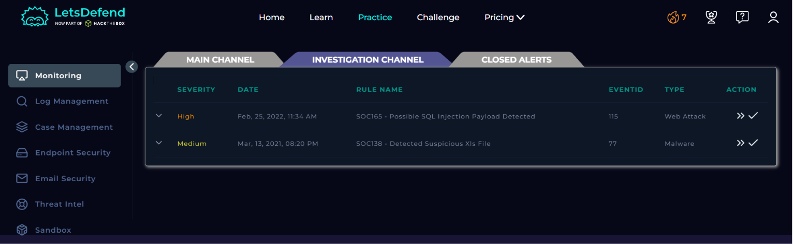

---

# Reviewing Event Details

The alert reason mentioned that the requested URL contained the pattern `OR 1=1`, which is a well-known SQL Injection payload often used to bypass authentication systems.

The event details also showed:
- Source IP Address: `167.99.169.17`
- Destination IP Address: `172.16.17.18`
- Request Method: `GET`

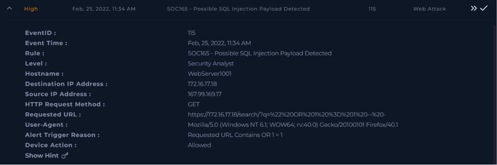

---

# Creating the Investigation Case

After validating the alert information, I created a case inside LetsDefend to officially begin the investigation workflow.


---

# Extracting the Suspicious URL

The requested URL looked URL-encoded, so I copied the payload from the alert details for further analysis.

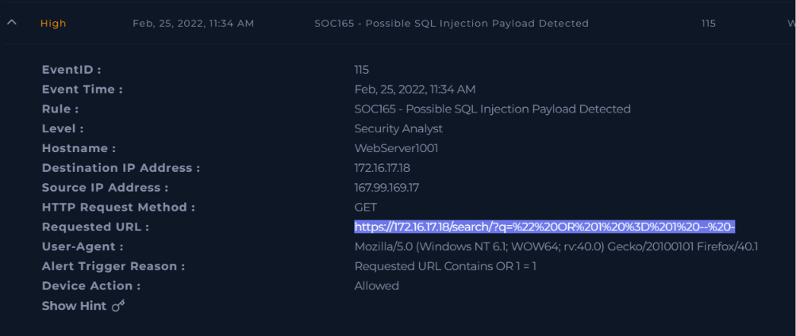

---

# Decoding the Payload

I used an online URL decoder to decode the suspicious request.

The decoded payload revealed:

```text
" OR 1 = 1 --
```

This is a common SQL Injection technique used to manipulate backend database queries.

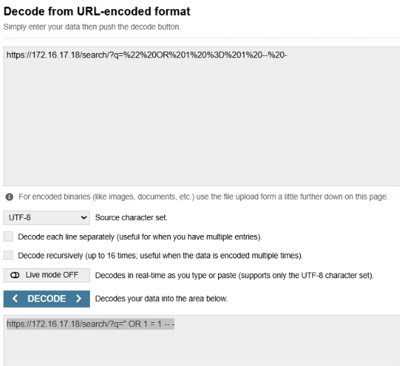

---

# Investigating the Source IP

To verify the reputation of the source IP, I searched the address on VirusTotal.

The IP address was flagged by multiple security vendors as malicious and suspicious.

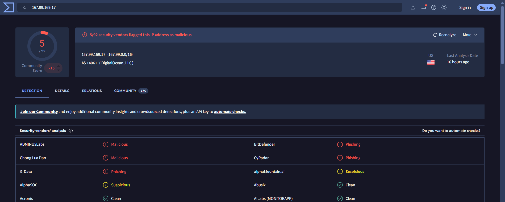

---

# Confirming the Traffic Was Malicious

Based on the decoded SQL Injection payload and malicious IP reputation, I classified the traffic as malicious inside LetsDefend.

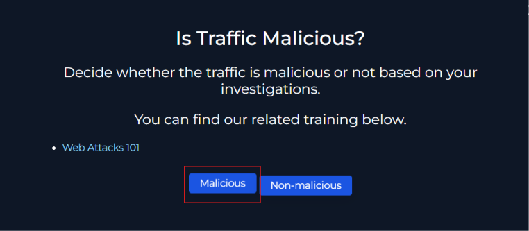

---

# Reviewing Firewall Logs

I checked related firewall logs to identify additional connections from the same source IP address.

Multiple requests were observed targeting the destination server over port 443.

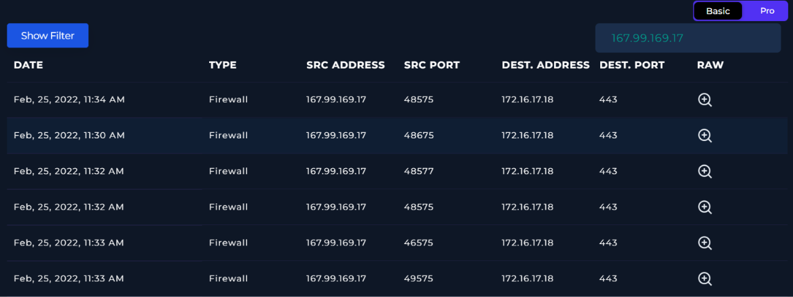

---

# Analyzing Raw Logs

The raw logs provided additional details about the HTTP request.

The request received an HTTP `200` response, meaning the server processed the request successfully.

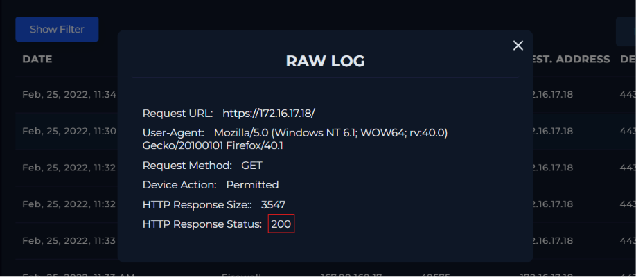

---

# Checking for Planned Activity

I verified whether the activity was part of a planned penetration test or attack simulation.

No evidence suggested the activity was authorized, so it was marked as `Not Planned`.

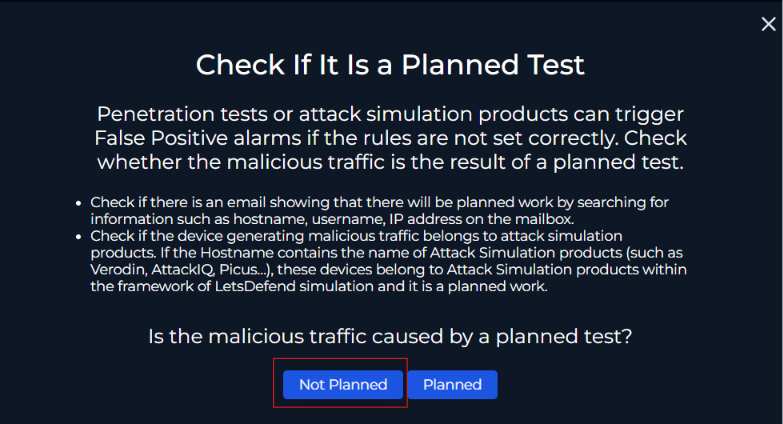

---

# Reviewing Endpoint Information

I reviewed the endpoint information related to the affected server.

The hostname `WebServer1001` and internal IP address `172.16.17.18` were identified during the investigation.

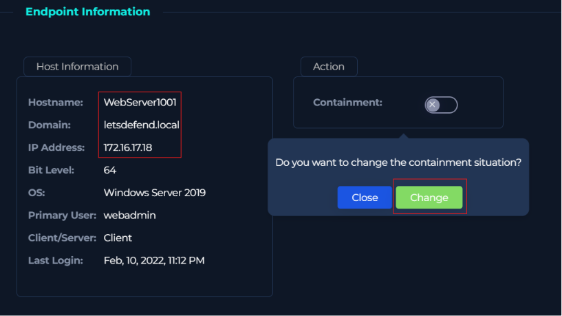

---

# Verifying Attack Success

During the investigation, I checked whether the SQL Injection attack was successful.

Based on the available logs and investigation findings, the attack was marked as unsuccessful.

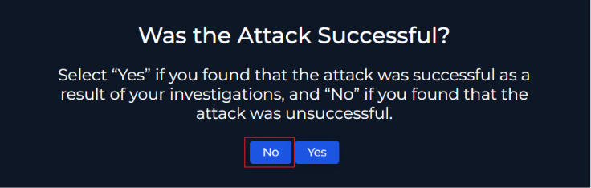

---

# Writing Analyst Notes

I documented the investigation findings inside the analyst notes section.

The notes included details about the SQL Injection payload, malicious IP reputation, and investigation summary.

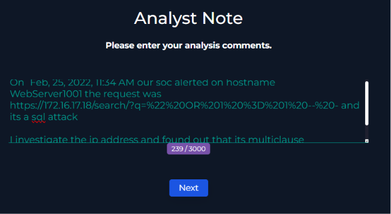

---

# Completing the Playbook

After finishing all investigation steps, the LetsDefend playbook was successfully completed.

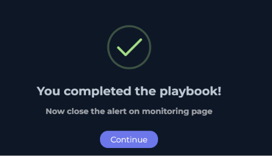

---

# Closing the Alert

The alert was closed as a `True Positive` because the investigation confirmed malicious SQL Injection activity.

Additional notes were added before closing the alert.

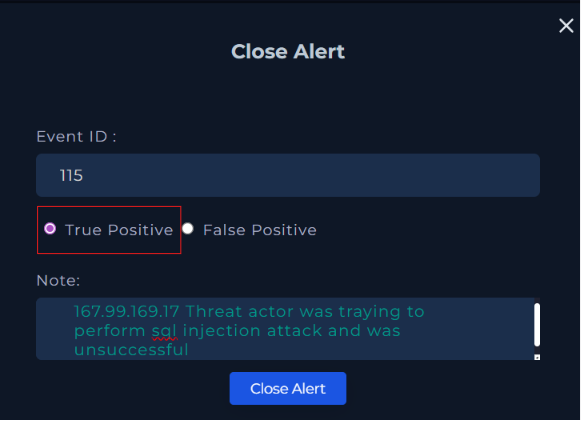

---

# Final Investigation Result

The closed alert summary confirmed:
- SQL Injection attack detected
- Traffic classified as malicious
- Activity was not planned
- Attack was unsuccessful
- Alert marked as True Positive

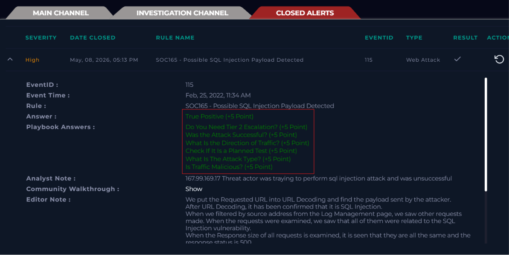

---

# Conclusion

The investigation confirmed a malicious SQL Injection attempt against the target web server.

The attacker used a URL-encoded payload containing:

```text
" OR 1 = 1 --
```

The source IP address was flagged as malicious by multiple vendors on VirusTotal.  
Firewall and raw log analysis showed repeated suspicious requests targeting the server.  
After validating the activity was not part of an authorized test, the alert was classified as a True Positive attack.

---

# Artifacts

| Type | Value |
|------|------|
| Event ID | 115 |
| Source IP | 167.99.169.17 |
| Destination IP | 172.16.17.18 |
| Attack Type | SQL Injection |
| Request Method | GET |
| Response Status | 200 |

---

# Disclaimer

This writeup is created for educational and documentation purposes only.  
All investigations were performed inside the LetsDefend training platform.