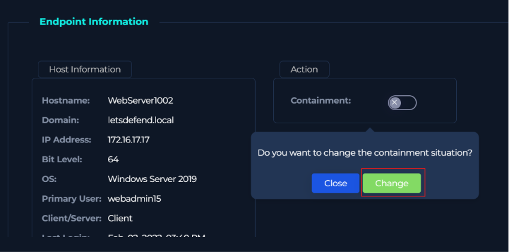
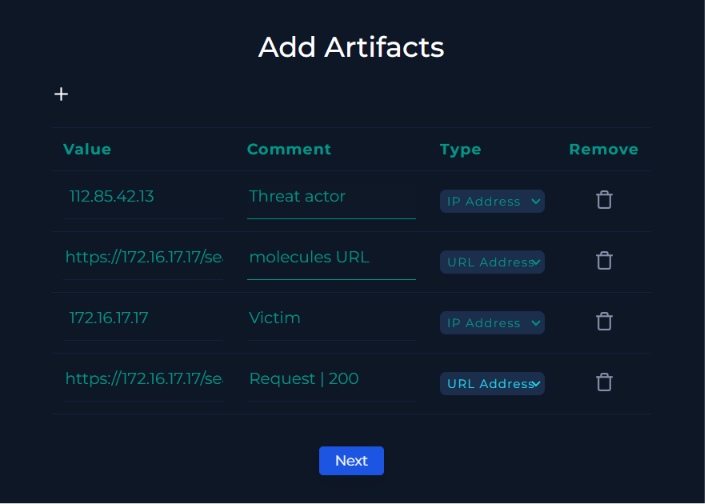
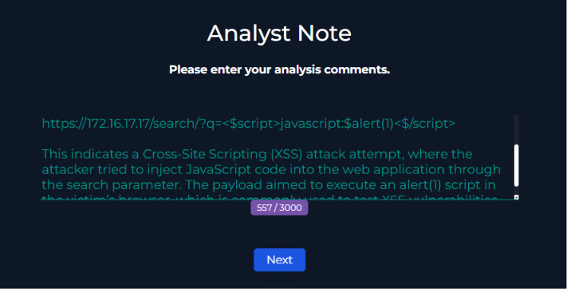
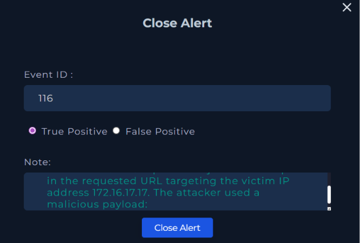
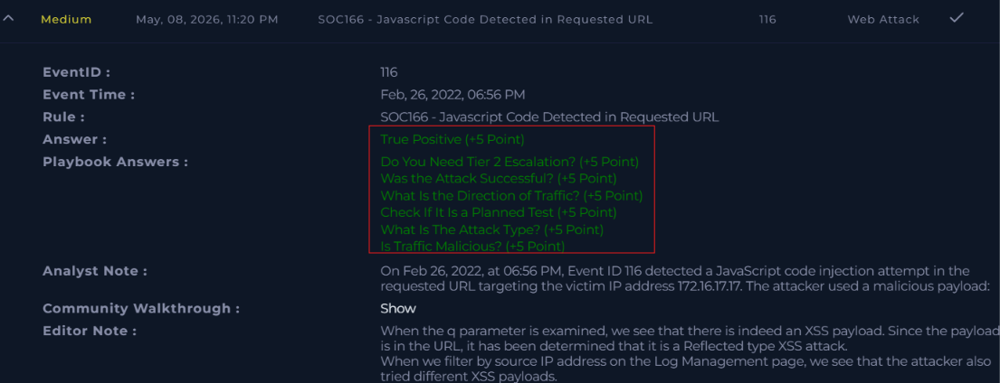

# SOC166 - Javascript Code Detected in Requested URL

## Alert Information

| Field | Value |
|--------|--------|
| Alert Name | SOC166 - Javascript Code Detected in Requested URL |
| Event ID | 116 |
| Severity | Medium |
| Category | Web Attack |
| Technique | Cross-Site Scripting (XSS) |
| Platform | LetsDefend |

---

## Scenario

The SOC received an alert related to suspicious JavaScript code detected inside a requested URL.  
The objective of the investigation was to verify whether the request was malicious and determine if the attack was successful.

---

## Investigation Started

The investigation began from the LetsDefend investigation dashboard where the alert was triggered under the Web Attack category.

---

## Reviewing Alert Details

The event details showed JavaScript code embedded inside the URL parameter.  
The payload attempted to execute `alert(1)` using a script injection technique commonly seen in XSS attacks.

---

## Creating the Incident Case

A case was created for Event ID 116 in order to begin the incident response and investigation process.

---

## Threat Intelligence Check

The source IP address `112.85.42.13` was investigated using threat intelligence platforms.  
Some vendors classified the IP as malicious or suspicious which increased confidence that the activity was hostile.

---

## Incident Details

The incident dashboard confirmed the attack category as a web attack associated with JavaScript injection attempts.

---

## Classifying the Traffic

Based on the malicious payload and threat intelligence results, the traffic was marked as malicious.

---

## Reviewing Firewall Logs

Firewall logs showed multiple HTTPS requests from the attacker IP to the destination server `172.16.17.17`.  
This indicated repeated interaction attempts with the target web application.

---

## Inspecting Legitimate Traffic

A normal request to the web server returned an HTTP `200 OK` response which represented successful and expected communication.

---

## Inspecting the Malicious Request

The malicious request containing the JavaScript payload returned an HTTP `302` response.  
This suggested the application redirected the request instead of processing the payload successfully.

---

## Attack Outcome

The attack was determined to be unsuccessful because the payload execution was not confirmed and the server redirected the request.

---

## Endpoint Containment Check

The endpoint information for the affected server was reviewed.  
Containment was checked during the investigation process to ensure proper incident handling procedures were followed.

---

## Adding Artifacts

Relevant indicators such as attacker IP addresses, URLs, and victim IP addresses were added as artifacts to document the investigation findings.

---

## Analyst Notes

Detailed analyst notes were added explaining that the activity was an attempted Cross-Site Scripting (XSS) attack using a malicious JavaScript payload.

---

## Finishing the Playbook

After completing all investigation steps and documenting the findings, the playbook was finalized and confirmed.

---

## Closing the Alert

The alert was closed as a True Positive because malicious JavaScript code was clearly identified inside the requested URL.

---

## Final Investigation Result

The final investigation summary confirmed that the alert was a True Positive web attack involving an attempted reflected XSS payload.

---

## Conclusion

This investigation focused on analyzing a suspicious JavaScript payload detected inside a requested URL.  
By reviewing event logs, firewall traffic, HTTP responses, and threat intelligence data, it was confirmed that the activity was malicious.  
Although the attacker attempted to exploit a Cross-Site Scripting (XSS) vulnerability, the payload execution was unsuccessful.

---

## Artifacts

| Type | Value |
|------|------|
| Source IP | 112.85.42.13 |
| Destination IP | 172.16.17.17 |
| Attack Type | Cross-Site Scripting (XSS) |
| HTTP Method | GET |
| HTTP Status Code | 302 |
| Event ID | 116 |

---

## Tools Used

- LetsDefend SIEM
- Threat Intelligence Platform
- Firewall Logs
- HTTP Request Analysis

---

> This project was created for educational and cybersecurity training purposes only.