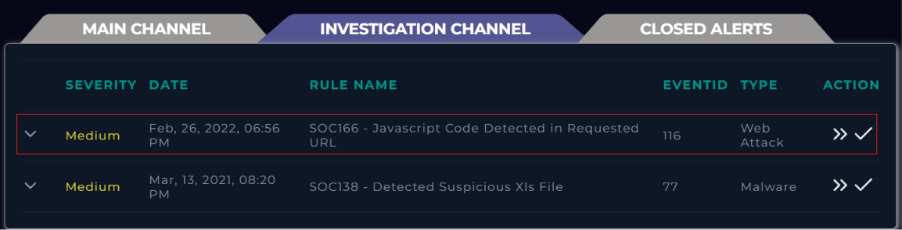
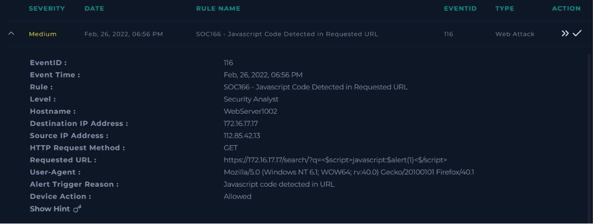
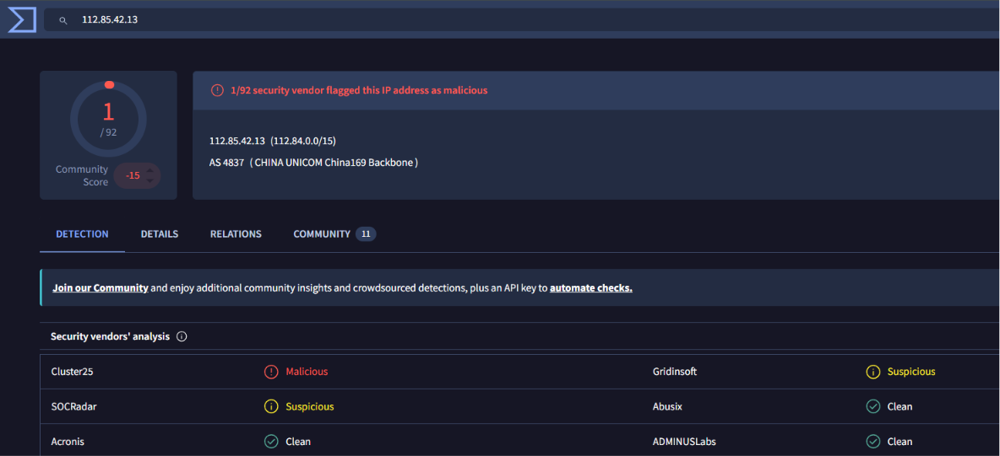
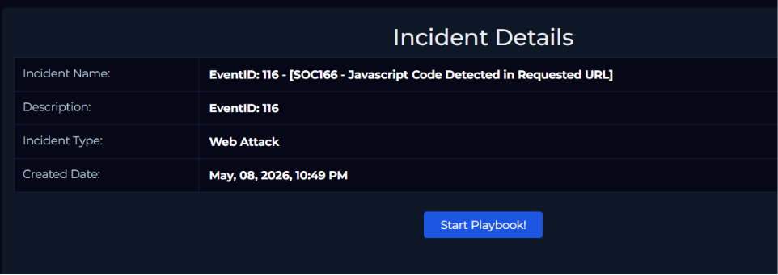
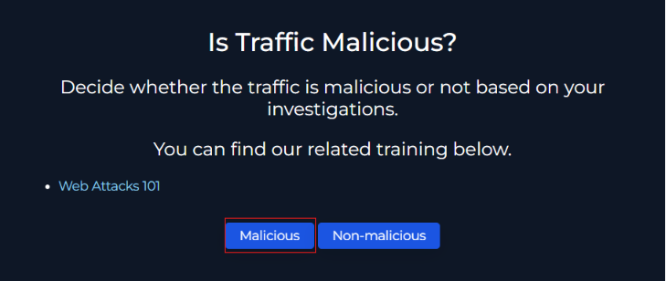
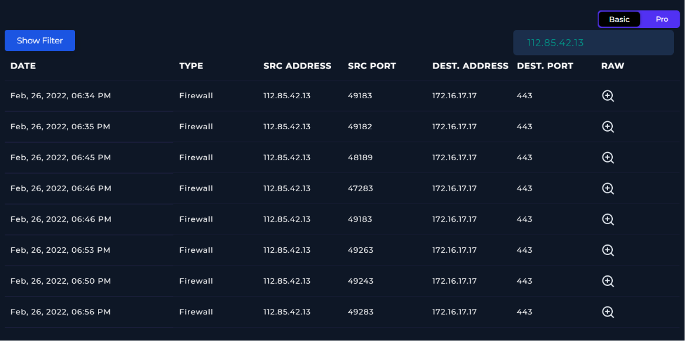
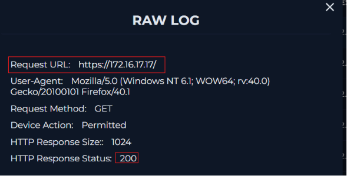
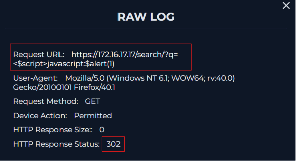

# SOC166 - Javascript Code Detected in Requested URL

## Alert Information

| Field | Value |
|--------|--------|
| Alert Name | SOC166 - Javascript Code Detected in Requested URL |
| Event ID | 116 |
| Severity | Medium |
| Category | Web Attack |
| Technique | Cross-Site Scripting (XSS) |
| Platform | LetsDefend |

---

## Scenario

The SOC received an alert for suspicious JavaScript code detected inside a requested URL.  
The investigation focused on identifying whether the request was malicious and determining if the attack was successful.

---

## Alert Overview

The investigation started by reviewing the triggered alert from the investigation channel.  
The alert showed JavaScript code embedded inside the URL parameter which is commonly used in XSS attacks.

---

## Event Details Analysis

After opening the alert details, the requested URL contained a payload attempting to execute JavaScript using ``.  
The source IP address and HTTP request method were also identified from the event logs.

---

## Creating the Incident Case

A case was created for Event ID 116 to begin the investigation workflow and collect evidence related to the alert.

---

## Investigating the Source IP

The source IP `112.85.42.13` was checked using threat intelligence platforms.  
One security vendor marked the IP as malicious while another marked it as suspicious, increasing the confidence that the traffic was hostile.

---

## Incident Information

The incident dashboard confirmed that the alert type was categorized as a web attack.  
This helped narrow the investigation toward web exploitation attempts such as XSS.

---

## Determining Malicious Activity

Based on the injected JavaScript payload and threat intelligence results, the traffic was classified as malicious.

---

## Reviewing Network Logs

Firewall logs were analyzed to track communication between the attacker IP and the destination server `172.16.17.17`.  
Multiple requests were observed targeting the web server over HTTPS port 443.

---

## Inspecting Normal Web Requests

A normal request to the server returned an HTTP `200 OK` response, indicating standard successful communication with the web application.

---

## Inspecting the Malicious Request

The malicious request containing the JavaScript payload returned an HTTP `302` response instead of `200`.  
This suggested the request was redirected and the attack payload was not successfully executed.

---

## Final Verdict

The investigation confirmed that the request was malicious because it contained an XSS payload attempting JavaScript execution.  
However, the attack was not successful since the application redirected the request and no evidence of payload execution was found.

---

## Conclusion

This investigation involved analyzing a suspected XSS attack detected by LetsDefend.  
By reviewing event details, threat intelligence results, firewall logs, and HTTP responses, it was determined that the traffic was malicious but the attack attempt failed.

---

## Artifacts

| Type | Value |
|------|------|
| Source IP | 112.85.42.13 |
| Destination IP | 172.16.17.17 |
| Attack Type | Cross-Site Scripting (XSS) |
| HTTP Method | GET |
| Response Code | 302 |
| Event ID | 116 |

---

> This project was created for educational and cybersecurity training purposes only.