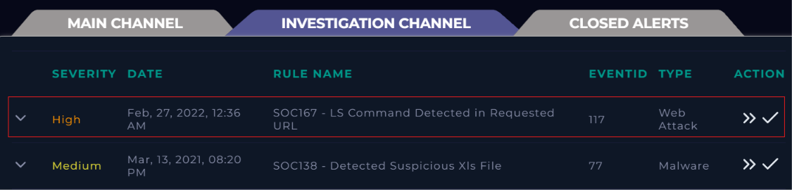
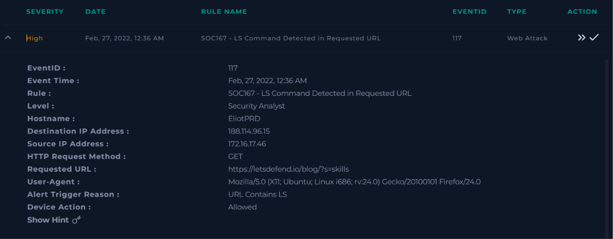
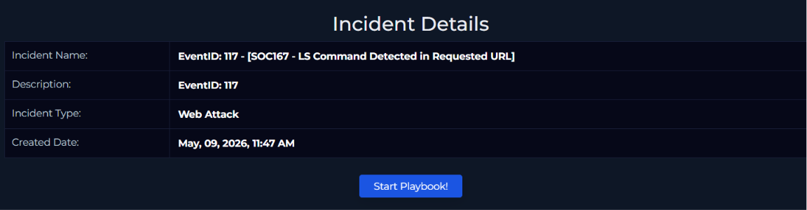
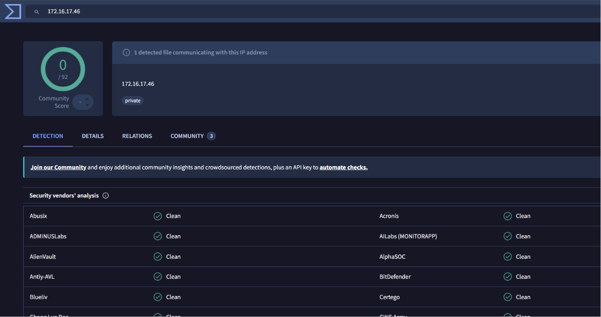
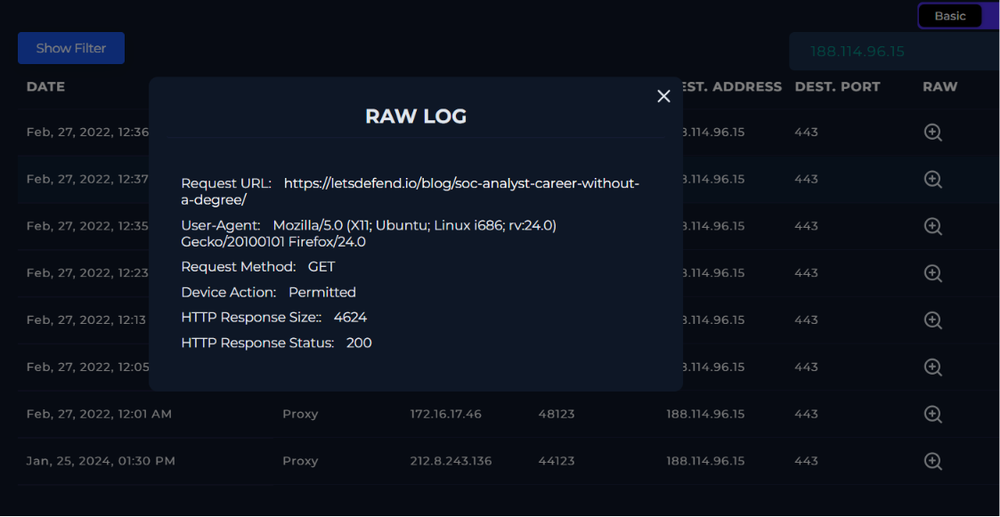
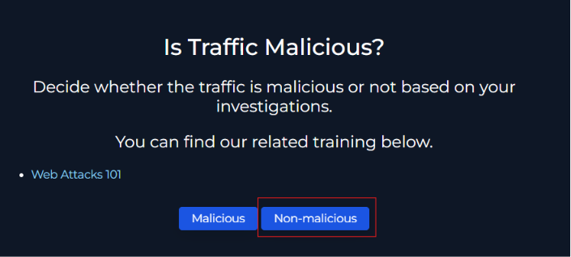
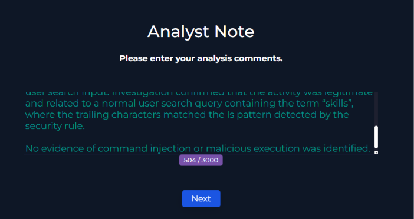
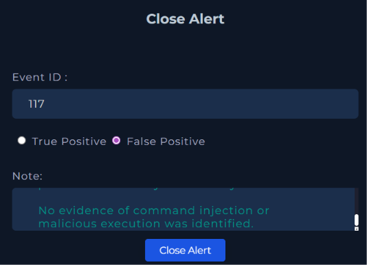
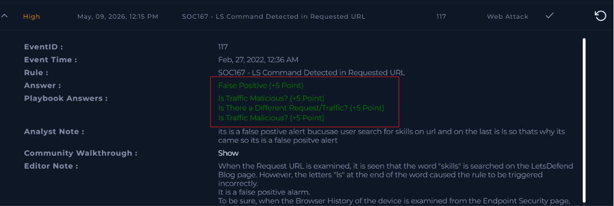

# SOC167 - LS Command Detected in Requested URL

## Room Link
https://app.letsdefend.io/

## Alert Details

| Field | Value |
|---|---|
| Alert Name | SOC167 - LS Command Detected in Requested URL |
| Event ID | 117 |
| Severity | High |
| Category | Web Attack |
| Detection Time | Feb 27, 2022 - 12:36 AM |

---

## Scenario

A web attack alert was triggered because the security rule detected the pattern `ls` inside the requested URL.  
The investigation focused on determining whether the traffic was an actual command injection attempt or a false positive generated from normal user activity.

---

## Alert Overview

The alert appeared in the investigation queue with a High severity level.  
The rule detected `ls` inside the URL and flagged it as a possible command execution attempt.

---

## Investigating Alert Details

The alert details showed the source IP address, destination IP address, HTTP request method, and the requested URL.  
The requested URL contained the word `skills`, which likely triggered the detection because it ends with the letters `ls`.

---

## Creating the Case

A case was created to begin the investigation and follow the incident response workflow inside LetsDefend.

---

## Incident Information

The incident page confirmed the alert classification as a web attack and provided the event information required for further analysis.

---

## Checking IP Reputation

The source IP address was investigated using VirusTotal.  
No malicious detections or suspicious reputation indicators were identified for the IP address.

---

## Reviewing Raw Logs

The raw logs showed a normal HTTP GET request to a LetsDefend blog page. 
And I check each log and found out its not harmful request. 
The request was related to searching for the keyword `skills` and no malicious payloads or command injection attempts were observed.

---

## Traffic Analysis

After reviewing the logs and reputation results, the traffic was identified as non-malicious.  
The detection was triggered because the substring `ls` appeared at the end of the word `skills`.

---

## Analyst Notes

Investigation notes were added explaining that the alert was a false positive caused by a normal search query.  
No evidence of command execution or malicious activity was discovered during the investigation.

---

## Closing the Alert

The alert was closed as a False Positive after confirming that the activity was legitimate user traffic.

---

## Final Result

The completed investigation confirmed that the SOC alert was incorrectly triggered by the word `skills` in the URL.  
The activity was legitimate browsing behavior and not an actual LS command injection attempt.

---

## Conclusion

This investigation demonstrated how simple keyword-based detections can sometimes generate false positives.  
By analyzing the request URL, reviewing logs, and checking IP reputation, the alert was correctly identified as non-malicious and safely closed.

---

## Tools Used

- LetsDefend SIEM
- VirusTotal
- HTTP Log Analysis

---

## Disclaimer

This project was performed in a controlled training environment for educational and learning purposes only.