# SOC169 - Possible IDOR Attack Detected

## Alert Information

| Field | Value |
|---|---|
| Platform | LetsDefend |
| Alert Name | SOC169 - Possible IDOR Attack Detected |
| Event ID | 119 |
| Severity | Medium |
| Category | Web Attack |
| Attack Type | IDOR |
| Verdict | True Positive |

---

# Scenario

The SOC alert was triggered after multiple suspicious requests were detected against the `/get_user_info/` endpoint.  
The requests contained manipulated user ID parameters which indicated a possible IDOR (Insecure Direct Object Reference) attack attempt.

---

# Initial Alert Review

The investigation started from the main alert dashboard where the event details such as source IP, destination IP, rule name, and HTTP method were reviewed.

The alert information showed repeated POST requests targeting the same endpoint from the external IP `134.209.118.137`.

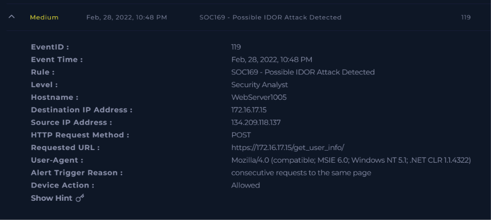

---

# Case Creation

A case was created for EventID 119 to begin the investigation and start the incident response process.

The incident details confirmed that the alert was categorized as a web attack associated with the SOC169 detection rule.

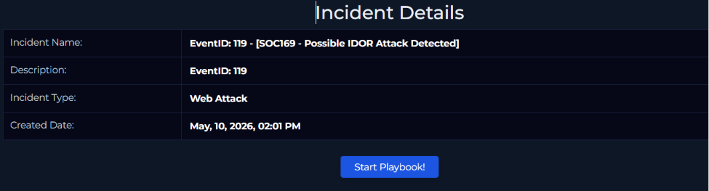

---

# Firewall Log Investigation

Firewall logs were analyzed to identify the communication pattern between the attacker and the target server.

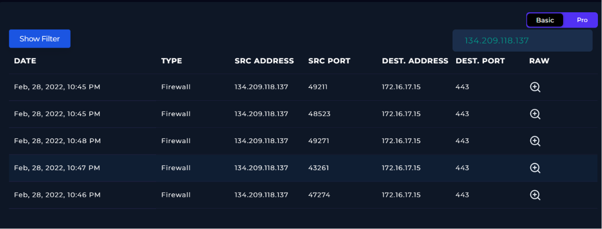

Multiple connections were observed within a short timeframe, which suggested automated enumeration or testing activity against the web application.

---

# Raw Log Analysis

The raw event logs showed that the attacker was sending POST requests to `/get_user_info/` with modified parameters.

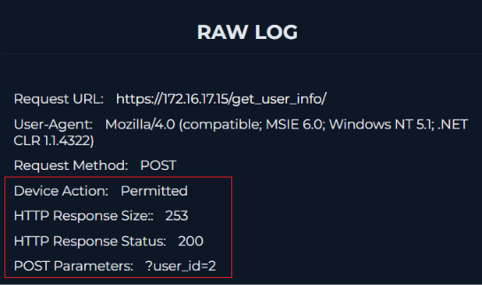

The parameter `user_id=2` indicated direct object reference manipulation, which is commonly associated with IDOR attacks.

The server returned `HTTP 200 OK`, confirming that the request was processed successfully by the application.

---

# Malicious Traffic Verification

The traffic behavior was reviewed to determine whether the activity was legitimate or malicious.

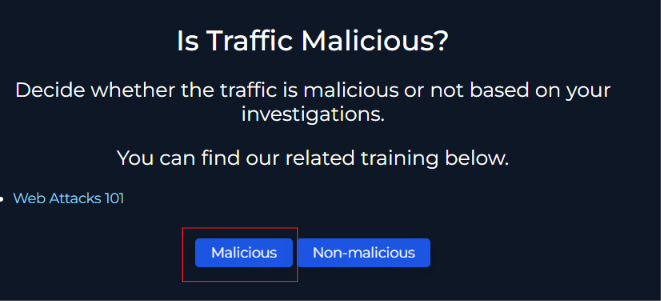

Based on the repeated requests, manipulated parameters, and successful responses from the server, the activity was classified as malicious.

---

# Attack Type Identification

The attack vector was identified as an IDOR attack because the attacker attempted to access unauthorized resources by changing object identifiers.

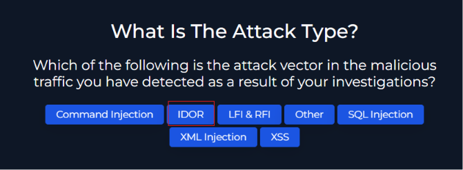

The modified `user_id` parameter strongly indicated unauthorized access attempts against user-related resources.

---

# Planned Test Validation

The environment was checked for any scheduled penetration tests or attack simulations that could have triggered the alert.

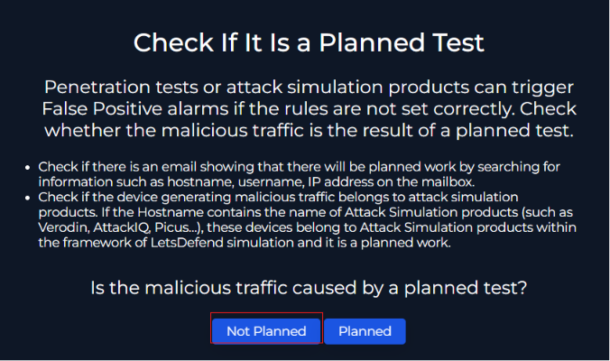

No evidence of planned testing or authorized security simulation activity was found during the investigation.

---

# Attack Success Determination

The investigation confirmed that the attack was successful because the application allowed the request and responded with a valid HTTP 200 status code.

This indicated that the web application did not properly validate authorization controls for user object access.

---

# Host Investigation

The affected host information was reviewed to identify the targeted server and containment status.

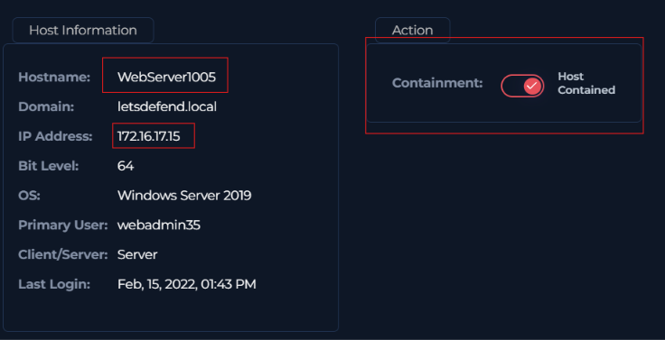

The server `WebServer1005` with IP `172.16.17.15` was identified as the affected system, and host containment actions were applied.

---

# Artifact Collection

Important artifacts related to the attack were added during the investigation process.

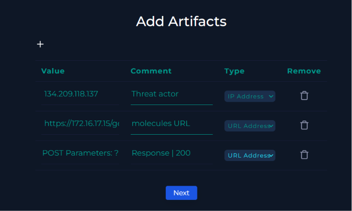

Artifacts included the attacker IP address, malicious URL, and POST parameter evidence observed in the raw logs.

---

# Tier 2 Escalation Decision

Since the attack was successful and involved unauthorized access attempts, Tier 2 escalation was required.

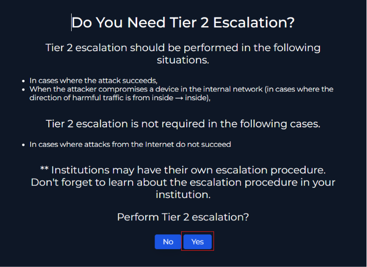

The escalation decision was made based on the successful response received from the target application.

---

# Analyst Notes

An analyst note was added to summarize the investigation findings and attack outcome.

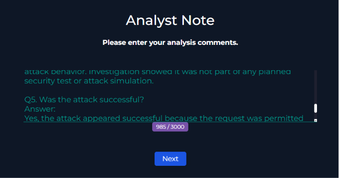

The notes confirmed that the activity was not part of any planned test and that the attack appeared successful.

---

# Final Alert Validation

The completed playbook answers confirmed the alert as a true positive IDOR attack.

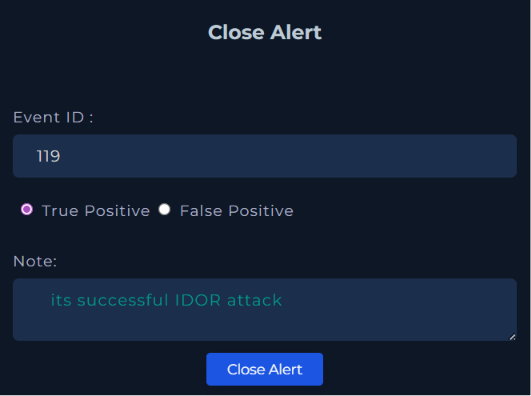

All investigation questions were successfully completed during the incident handling process.

---

# Alert Closure

After completing the investigation and validation steps, the alert was closed as a True Positive incident.

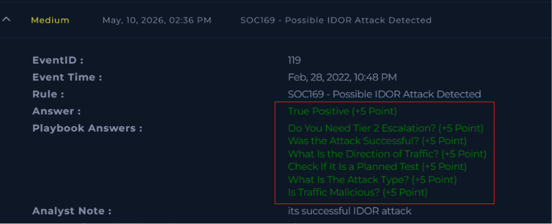

The final conclusion confirmed that the event was a successful IDOR attack against the web application.

---

# Conclusion

This investigation confirmed a successful IDOR attack against the target web application.  
The attacker manipulated the `user_id` parameter to access unauthorized resources without proper authorization checks.  
The server responded successfully to the malicious requests, indicating insecure access control implementation within the application.

The alert was correctly identified as a **True Positive** and escalated for further security handling.

---

# Tools Used

- LetsDefend SIEM
- Firewall Logs
- Raw Log Analysis
- Incident Playbook

---

# MITRE ATT&CK Mapping

| Technique ID | Description |
|---|---|
| T1190 | Exploit Public-Facing Application |

---

# Disclaimer

This project was created for educational and cybersecurity training purposes only.