# SOC170 - Passwd Found in Requested URL - Possible LFI Attack

## Alert Information

| Field | Value |
|---|---|
| Alert ID | 120 |
| Alert Name | SOC170 - Passwd Found in Requested URL - Possible LFI Attack |
| Severity | High |
| Category | Web Attack |
| Detection Time | Mar 01, 2022 - 10:10 AM |

---

## Scenario Overview

This alert was triggered because the requested URL contained references to `/etc/passwd`, which is commonly associated with Local File Inclusion (LFI) attacks.  
The investigation focused on validating the malicious request, analyzing the attacker activity, and determining whether the attack was successful.

---

## Tools Used

- LetsDefend SIEM
- Log Management
- VirusTotal
- Web Traffic Analysis

---

## Alert Detection

The investigation started after a high-severity alert appeared in the LetsDefend monitoring dashboard.  
The alert rule indicated a possible attempt to access sensitive Linux system files through a web request.

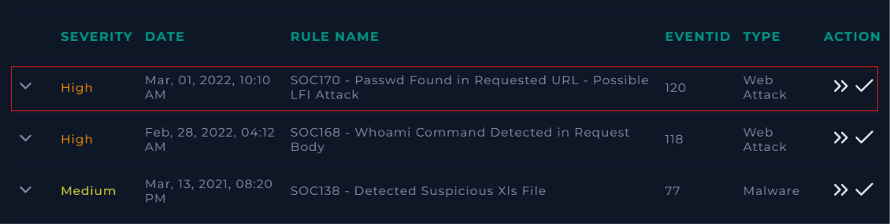

---

## Reviewing Alert Details

The alert details showed the source IP address, destination server, HTTP method, and suspicious request URL.  
The request attempted to access `/etc/passwd` using directory traversal sequences (`../../../../`), which is a strong indicator of an LFI attack attempt.

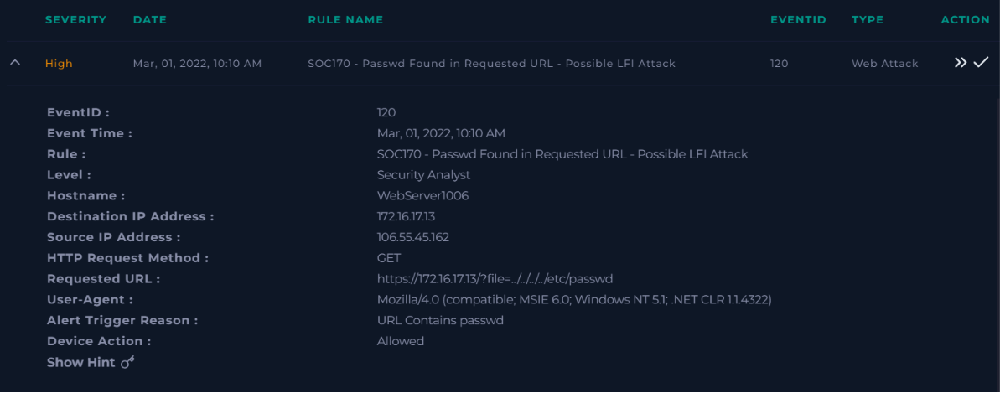

---

## Creating The Investigation Case

A new incident case was created to start the investigation process and document all findings related to the alert.

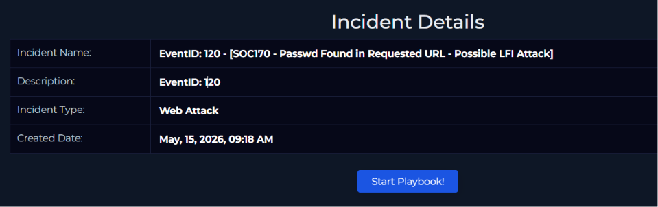

---

## Investigating Network Traffic And Raw Logs

The investigation identified a single suspicious connection from the external IP `106.55.45.162` targeting the internal server `172.16.17.13` over HTTPS port 443.  
Further raw log analysis confirmed the attacker attempted to access the `/etc/passwd` file through URL manipulation.

The HTTP response status returned `500`, indicating the request failed and the attack was unsuccessful.

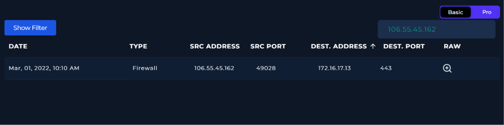

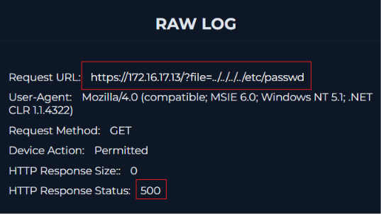

---

## Confirming Malicious Activity

Based on the payload structure and directory traversal technique observed in the logs, the traffic was classified as malicious.

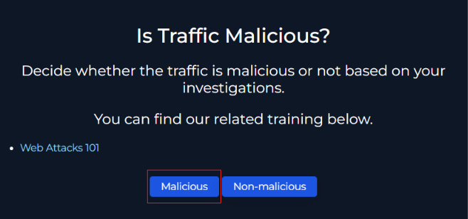

---

## Identifying The Attack Type

The attack vector was identified as **LFI/RFI** because the attacker attempted to access local system files through manipulated URL parameters.

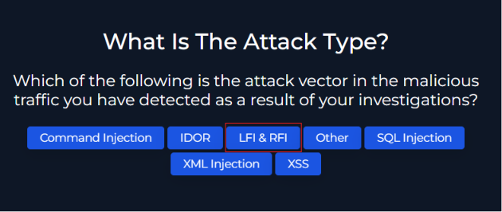

---

## Checking For Planned Activity

The investigation included verifying whether the activity originated from an authorized penetration test or internal simulation.  
No evidence of planned activity was found, so the incident was marked as not planned.

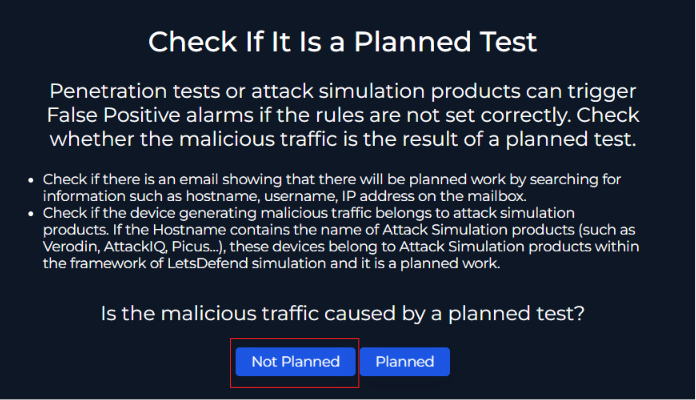

---

## IP Reputation Analysis And Traffic Direction

The source IP address was analyzed using VirusTotal to gather threat intelligence information.  
The IP location details showed the traffic originated externally from China, indicating the attack came from the internet targeting the internal company network.

Based on this analysis, the traffic direction was identified as **Internet → Company Network**.

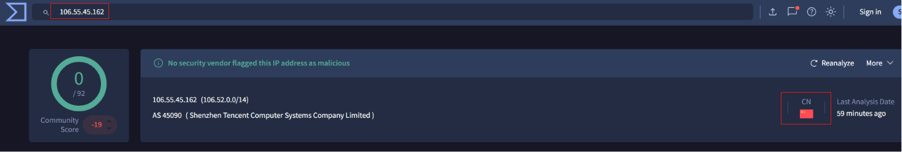

---

## Verifying Attack Success

The attack was determined to be unsuccessful because the server returned an HTTP 500 response and no sensitive file contents were exposed.

---

## Adding Investigation Artifacts

Important artifacts such as the attacker IP address, malicious URL, and victim server IP address were added to the case for proper documentation and tracking.

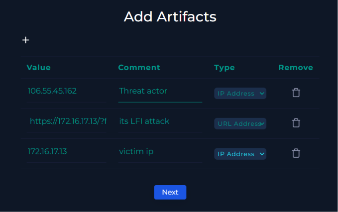

---

## Writing Analyst Notes

An analyst note was added summarizing the investigation findings, including the malicious request, affected target, and failed LFI attempt.

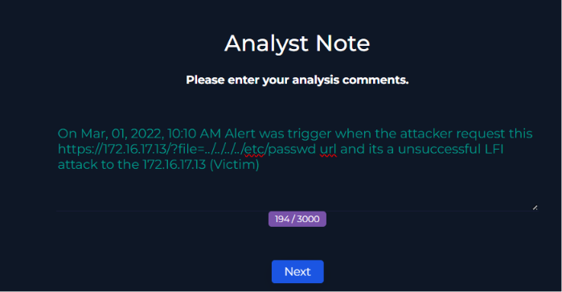

---

## Completing The Playbook And Closing The Alert

After completing the investigation steps and documenting all findings, the incident playbook was finalized successfully.  
The alert was then closed as a **True Positive** because the investigation confirmed a real malicious LFI attack attempt.

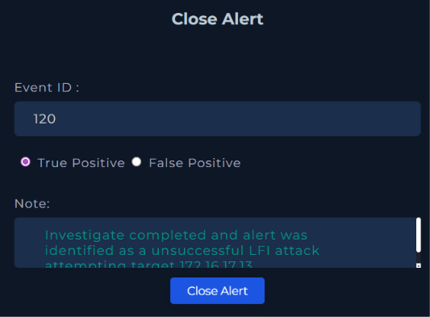

---

## Final Investigation Results

The final investigation summary confirmed that the incident was an unsuccessful Local File Inclusion (LFI) attack attempt targeting the internal web server.  
All findings and analyst notes were properly documented within the LetsDefend incident response workflow.

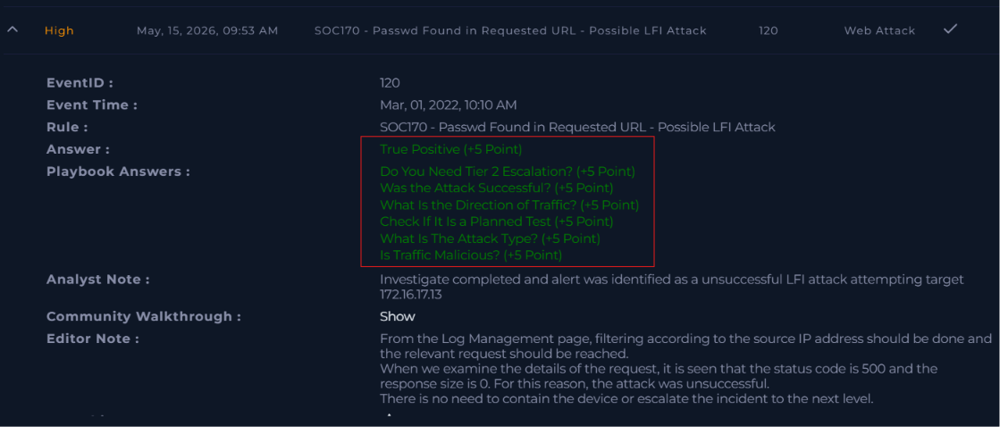

---

## Conclusion

This investigation confirmed an attempted Local File Inclusion (LFI) attack targeting the web server `172.16.17.13`.  
The attacker attempted to access the sensitive Linux `/etc/passwd` file using directory traversal techniques through a crafted URL request.  
The server responded with an HTTP 500 error, indicating the attack failed and no sensitive data was exposed.  
The incident was classified as a True Positive and documented successfully during the SOC investigation process.

---

## MITRE ATT&CK Mapping

| Technique ID | Description |
|---|---|
| T1006 | Path Traversal |
| T1190 | Exploit Public-Facing Application |

---

## Educational Purpose Disclaimer

This project was created for educational and defensive cybersecurity purposes only.  
All investigations and analysis were performed inside legal training environments provided by LetsDefend.